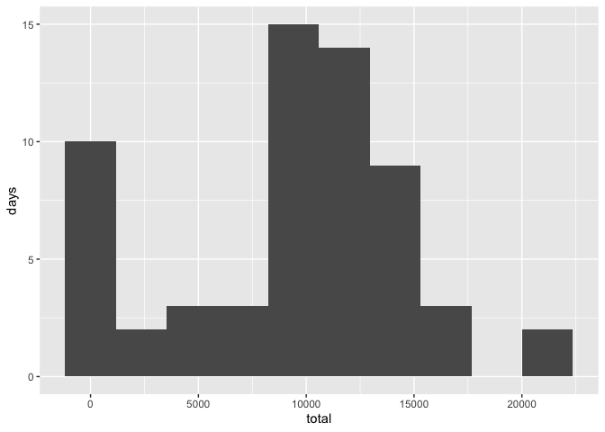
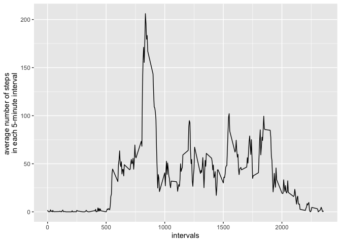
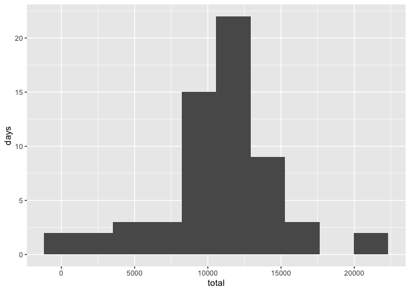
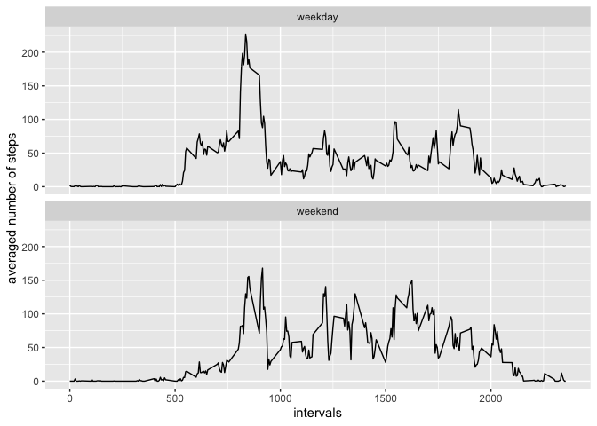

## Introduction

This project makes use of data from a personal activity monitoring device. This device collects data at 5 minute intervals throughout the day. The data consists of two months of data from an anonymous individual collected during the months of October and November, 2012 and include the number of steps taken in 5 minute intervals each day. 

This project consists of several parts which address specific questions regarding the data set and the activties of the person.

## 1. Loading and preprocessing the data

The data for this assignment can be downloaded from the course web site: [Activity monitoring data](https://d396qusza40orc.cloudfront.net/repdata%2Fdata%2Factivity.zip) [52K]

The variables included in this dataset are:

- **steps**: Number of steps taking in a 5-minute interval (missing
    values are coded as `NA`)
- **date**: The date on which the measurement was taken in YYYY-MM-DD
    format
- **interval**: Identifier for the 5-minute interval in which
    measurement was taken

The dataset is stored in a comma-separated-value (CSV) file and there are a total of 17,568 observations in this dataset.

The data was downloaded, unzipped and saved in the project directory and the file name is "activity.csv". The following code loads the packages used in this program, and reads in the data with read_csv(readr) and assigns it to the variable - activity.


```r
# load the libraries
library(tidyverse)
```

```
## ── Attaching packages ─────────────────────────────────────────────────────────────────────────────────────────────── tidyverse 1.3.0 ──
```

```
## ✔ ggplot2 3.2.1     ✔ purrr   0.3.3
## ✔ tibble  2.1.3     ✔ dplyr   0.8.3
## ✔ tidyr   1.0.0     ✔ stringr 1.4.0
## ✔ readr   1.3.1     ✔ forcats 0.4.0
```

```
## ── Conflicts ────────────────────────────────────────────────────────────────────────────────────────────────── tidyverse_conflicts() ──
## ✖ dplyr::filter() masks stats::filter()
## ✖ dplyr::lag()    masks stats::lag()
```

```r
library(ggplot2)
library(lubridate)
```

```
## 
## Attaching package: 'lubridate'
```

```
## The following object is masked from 'package:base':
## 
##     date
```

```r
# load the data
activity <- read_csv(file="activity.csv")
```

```
## Parsed with column specification:
## cols(
##   steps = col_double(),
##   date = col_date(format = ""),
##   interval = col_double()
## )
```

## 2. What is mean total number of steps taken per day?

This section includes code chunks we use to answer the question: what is the average total number of steps taken each day?

Specifically, we will do the following:  

- Calculate the total number of steps taken per day, i.e., ignoring the missing values in the dataset
- Calculate and report the mean and median of the total number of steps taken per day
- Make a histogram of the total number of steps taken each day

### 2.1 Total steps taken each day median


```r
# total steps each day: stepsPerDay
stepsPerDay <- activity %>% 
    group_by(date) %>%
    summarize(
      total = sum(steps, na.rm=TRUE)
    )
```


### 2.2 Make a histogram of the total number of steps taken each day


```r
# histogram for steps taken each day
ggplot(data = stepsPerDay, mapping = aes(x=total)) + 
    geom_histogram(bins = 10, na.rm=TRUE) + 
    ylab("days")
```

<!-- -->


### 2.3 The mean and median of the total number of steps taken per day


```r
mean_stepsPerDay <- mean(stepsPerDay$total, na.rm=TRUE)
median_stepsPerday <- median(stepsPerDay$total, na.rm=TRUE)
```

The mean and median of the total number of steps per day are respectively 9354 steps and 10395 steps.


## 3. What is the average daily activity pattern?

### 3.1 Time series plot

The following code chunk creates a time series plot of the 5-minute interval (x-axis) and the average number of steps taken, averaged across all days (y-axis).


```r
timeseries <- activity %>% 
    group_by(interval) %>%
    summarise(
        average = mean(steps, na.rm = TRUE)
    )

ggplot(data = timeseries, 
       mapping = aes(x=interval, average)) +
    xlab("intervals") +
    ylab("average number of steps \nin each 5-minute interval")+
    geom_line(na.rm=TRUE)
```

<!-- -->

### 3.2 The 5-minute interval(s) with the maximun number of steps on average across all the days


```r
# locate the interval(s) with the largest averaged number of steps
theInterval <- timeseries %>%
    filter(average == max(average))
```

Running the code chunk, yieds: the internal is 835, and the maximun number of steps is 206.

## 4. Imputing missing values

### 4.1 Number of records with missing values

The data set contains a number of days/intervals with missing values (coded as NA). The following code chunk create a data subset (rec_NA) containing all the records with missing values.


```r
# data subset contain all the records with missing values
rec_NA <- activity %>% 
  filter(is.na(steps)|is.na(date)|is.na(interval))

dim(rec_NA)
```

```
## [1] 2304    3
```
The total number of records with missing values are 2304.

### 4.2 & 4.3 Imputing missing values and create a new data set

The following code identifies the days with missing values. The outcome shows that all missing values occurred on the eight days:

1. 2012-10-01

2. 2012-10-08

3. 2012-11-01

4. 2012-11-04

5. 2012-11-09

6. 2012-11-10

7. 2012-11-14

8. 2012-11-30

Other than these eight days, there is no missing value for the rest of dates in the data.


```r
# identify the observations with missing values
activity %>%
    filter(is.na(steps)) %>%
    count(date) 
```

```
## # A tibble: 8 x 2
##   date           n
##   <date>     <int>
## 1 2012-10-01   288
## 2 2012-10-08   288
## 3 2012-11-01   288
## 4 2012-11-04   288
## 5 2012-11-09   288
## 6 2012-11-10   288
## 7 2012-11-14   288
## 8 2012-11-30   288
```

Without additional information, we would use the number of 5-minute interval steps averaged accross all days in October 2012 for 2012-10-01 and 2012-10-08; the steps averaged accross all days in November 2012 for 2012-11-01, 2012-11-04, 2012-11-09, 2012-11-10 2012-11-14,and 2012-11-30. The following code calculates the October and November averages and then uses the averages to fill the missing values for these eight days.

#### Imputing missing values for 2012-10-01 and 2012-10-08

```r
## averaged 5-minute interval steps each day in 10/2012
average_oct2012 <- activity %>%
    filter(date >=date("2012-10-01") & date <= date("2012-10-31")) %>%
    group_by(interval) %>%
    summarise(
        steps = as.integer(mean(steps, na.rm = TRUE))
    )

## repalace NA steps for 2012-10-01 and 2012-10-08 with the averaged steps
activity_oct2012narm <- activity %>% 
    mutate(
        steps = ifelse(date==date("2012-10-01"), 
                       average_oct2012$steps, 
                       steps ),
        steps = ifelse(date==date("2012-10-08"), 
                       average_oct2012$steps, 
                       steps )
    )
```

#### Imputing missing values for 2012-11-01, 2012-11-04, 2012-11-09, 2012-11-10 2012-11-14,and 2012-11-30


```r
## averaged 5-minute interval steps each day in 11/2012
average_nov2012 <- activity %>%
    filter(date >=date("2012-11-01") & date <= date("2012-11-30")) %>%
    group_by(interval) %>%
    summarise(
        steps = as.integer(mean(steps, na.rm = TRUE))
    )

## create a new data set (activity_narm) by further fill NA steps with the averages in November for the dates: 2012-11-01, 2012-11-04, 2012-11-09, 2012-11-10, 2012-11-14 and 2012-11-30

the6NovDates <- date(c("2012-11-01", "2012-11-04", "2012-11-09", "2012-11-10", "2012-11-14", "2012-11-30"))
activity_narm <- activity_oct2012narm %>% 
    mutate(
        steps = ifelse(date %in% the6NovDates, 
                       average_nov2012$steps, 
                       steps)
    )
```

### 4.4 Histogram of the total number of steps, and mean and median of total number of steps taken per day from the new data set

A histogram of the total number of steps taken each day:


```r
# total steps each day: step_day
stepsPerDay_new <- activity_narm %>% 
    group_by(date) %>%
    summarize(
      total = sum(steps, na.rm=TRUE)
    )

# histogram for steps taken each day
ggplot(data = stepsPerDay_new, mapping = aes(x=total)) + 
    geom_histogram(bins = 10, na.rm=TRUE)+
    ylab("days")
```

<!-- -->


The mean and median of the total number of steps taken per day from the new data set:


```r
mean_stepsPerDay_new <- mean(stepsPerDay_new$total)
median_stepsPerday_new <- median(stepsPerDay_new$total)
```

The mean and median of the total number of steps per day from the new data set are respectively 10749 steps and 10631 steps. The mean and median from the original data are respectively 9354 steps and 10395 steps. 

The effect of imputing NAs is an increase in both the mean and median total number of steps taken per day, which is also reflected on the change in the histogram of the total number of steps taken per day.

## 5 Are there differences in activity patterns between weekdays and weekends?

The new dataset (activity_narm) with the filled-in missing values is used for this part. The following code was created to address the question: Are there differences in activity patterns between weekdays and weekends?


```r
weekend <- c("Saturday", "Sunday")
activity_narm %>%
  # add weekday variable which takes on a value of "weekend" or "weekday"
  mutate(
    weekday = ifelse(weekdays(date) %in% weekend, "weekend", "weekday")
  ) %>%
  # calculate average steps by weekday and by intervals
  group_by(weekday, interval) %>%
  summarize(
    average = mean(steps, na.rm = TRUE)
  ) %>%
  # plot steps time series for weekday and weekend
  ggplot(mapping = aes(x=interval, average)) +
    geom_line(na.rm=TRUE) +
    facet_wrap(~weekday, nrow=2) +
    xlab("intervals") +
    ylab("averaged number of steps")
```

<!-- -->

The time series plots above show the following differences in activity patterns between weekday and weekend:

- at the start of day, weekday shows a higher level of activity

- on weekend, the activity seems to end later 

- it appears during the day the individual was more active on weekend than weekday.
